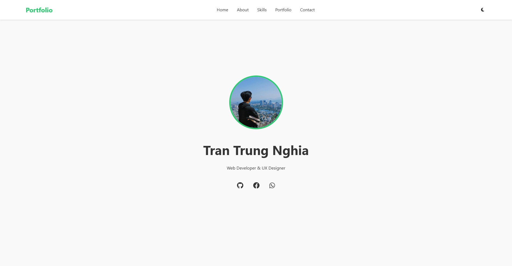

# Personal Portfolio Website 🚀



A modern, responsive portfolio website built with HTML, CSS, and JavaScript. Features a clean design, dark mode, smooth animations, and a contact form powered by EmailJS.

## ✨ Features

-   🌓 Dark/Light mode toggle
-   📱 Fully responsive design
-   🎯 Smooth scroll navigation
-   💫 Animated skill bars
-   📬 Contact form with EmailJS integration
-   ⚡ AOS (Animate On Scroll) animations
-   📊 Timeline-based education & experience sections
-   🎨 Modern UI/UX with hover effects

## 🛠️ Technologies Used

-   HTML5
-   CSS3
-   JavaScript (ES6+)
-   [EmailJS](https://www.emailjs.com/) - Contact form functionality
-   [AOS](https://michalsnik.github.io/aos/) - Scroll animations
-   [Font Awesome](https://fontawesome.com/) - Icons
-   [Google Fonts](https://fonts.google.com/) - Typography

## 🚀 Quick Start

1. Clone the repository:

```bash
git clone https://github.com/trantrungnghia414/my-profile.git
```

2. Create `.env` file in root directory:

```bash
env
PUBLIC_KEY=your_emailjs_public_key
SERVICE_ID=your_emailjs_service_id
TEMPLATE_ID=your_emailjs_template_id
```

3. Set up EmailJS:

    - Sign up at [EmailJS](https://www.emailjs.com/)
    - Create an Email Service
    - Create an Email Template
    - Copy your API keys to `.env` file

4. Open `index.html` in your browser or use a live server

## 📋 Project Structure

```bash
portfolio/
├── index.html # Main HTML file
├── styles.css # Stylesheet
├── script.js # JavaScript functionality
├── img/ # Image assets
├── .env # Environment variables
└── README.md # Project documentation
```

## 🎯 Sections

-   **Home** - Introduction and social links
-   **About** - Education and experience timeline
-   **Skills** - Technical skills with progress bars
-   **Portfolio** - Featured projects with links
-   **Contact** - Contact form and information

## 📱 Responsive Design

The website is fully responsive and optimized for:

-   Desktop (1200px and above)
-   Tablet (768px to 1199px)
-   Mobile (below 768px)

## 🌐 Live Demo

Visit the live website: [Portfolio Demo](https://trungnghia03tv.vercel.app/)

## 📬 Contact Form Setup

1. Create an EmailJS account
2. Set up an email service
3. Create an email template with variables:
    - {{from_name}}
    - {{from_email}}
    - {{message}}
4. Update environment variables

## 🤝 Contributing

Contributions, issues, and feature requests are welcome! Feel free to check [issues page](https://github.com/trantrungnghia414/my-profile/issues).

## 📝 License

This project is [MIT](./LICENSE) licensed.

## 👨‍💻 Author

**Tran Trung Nghia**

-   GitHub: [@trantrungnghia414](https://github.com/trantrungnghia414)
-   Facebook: [Trung Nghia](https://www.facebook.com/lucky.nghia.5)
-   Instagram: [@trantrungnghia03](https://www.instagram.com/trantrungnghia03/)

---

⭐️ From [Tran Trung Nghia](https://github.com/trantrungnghia414)
